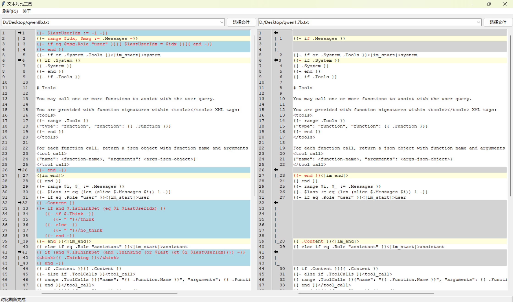
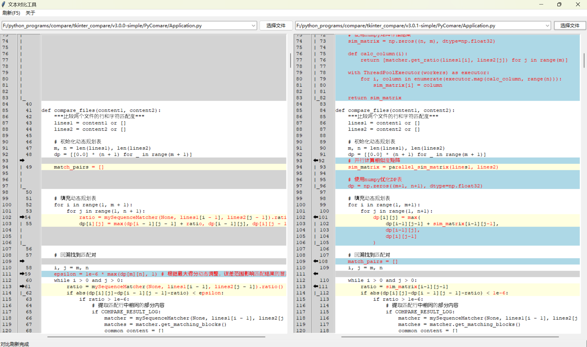
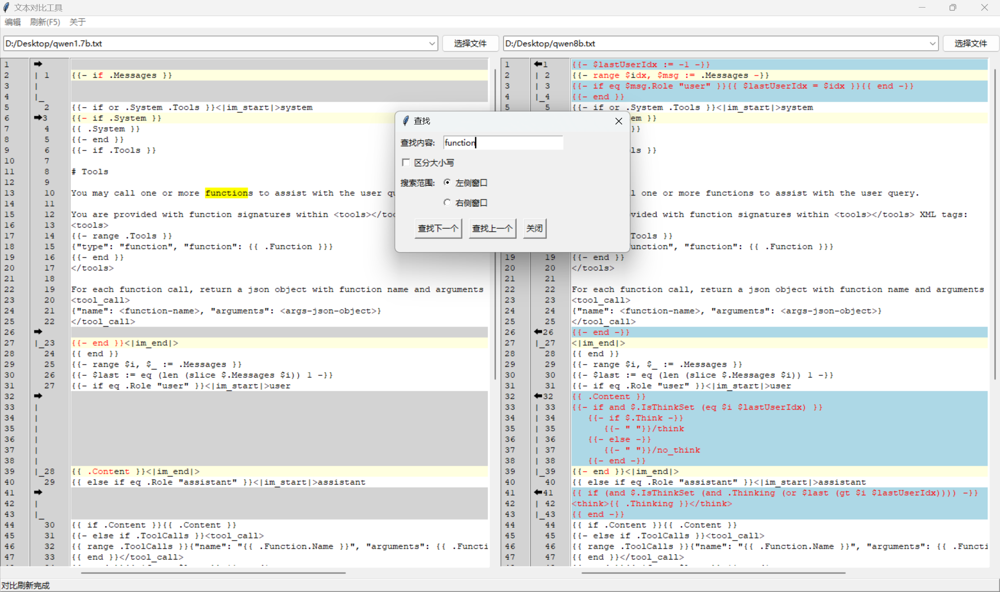
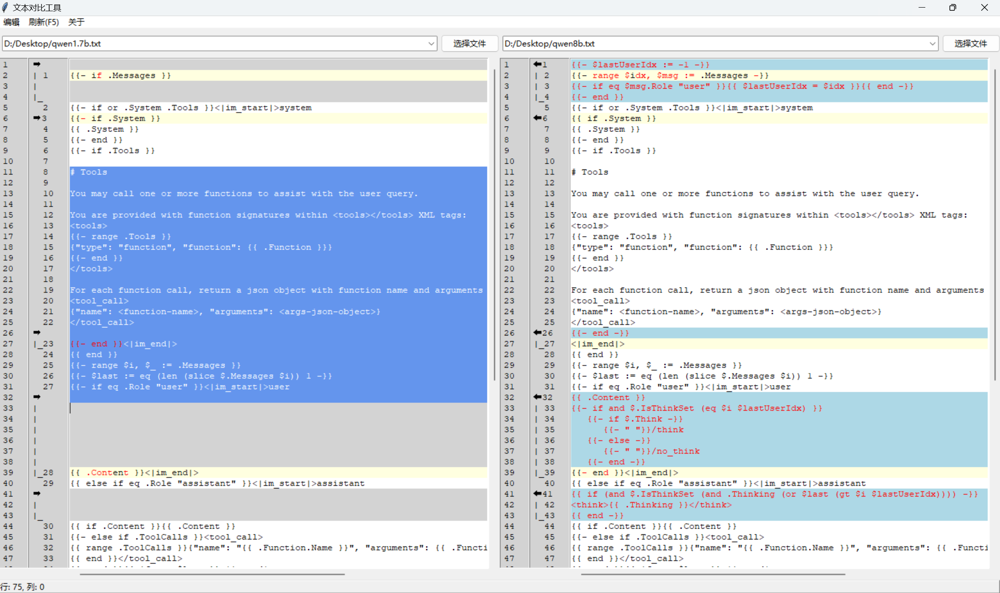

# PyCompare 

文本内容对比工具，参照Beyond Compare 4 版本实现，该软件仅支持windows下文本内容对比，不支持动态合并及保存。

## 功能概述
PyCompare 是一个基于 Python 和 Tkinter 的文本对比工具，主要功能包括：

- 并行文本对比
- 差异高亮显示
- 文件历史记录管理
- 行号同步显示
- 支持文件拖拽
- 支持utf-8编码
- 临时修改文件内容，不影响源文件内容

## 使用示例
**对比效果**

**搜索功能**

**选择功能**

## 快捷键

- F5: 刷新对比结果
- Ctrl+F: 打开查找对话框
- Ctrl+C: 复制选中内容
- Ctrl+V: 粘贴内容
- Ctrl+X: 剪切选中内容

## 支持  
- 问题反馈：Issue 区留言。

## 赞助

- 爱发电：[https://afdian.com/a/binn123456](https://afdian.com/a/binn123456)

## 常见问题
**1. 软件被识别有威胁或为病毒**
   - 该软件未被加密，未包含任何恶意代码，也未被添加到任何病毒数据库中。
   - 该软件打包使用了upx技术，upx是一个开源的可执行文件压缩工具，用于压缩可执行文件的大小，减少文件大小，提高加载速度。但是通过upx压缩后的软件，可能会被一些杀毒软件识别为病毒。
   - 当被杀毒软件是被为异常软件，如果软件运行正常，建议忽略该警告。如果软件不能正常运行，可以把软件加入到杀毒软件的白名单中，以避免被识别为病毒。或者下载非opt版本。提示：opt版本是通过upx压缩后的版本，可能会被一些杀毒软件识别为病毒；opt版本是未压缩版本的几倍大小，不过该软件本身很小（28MB），不会有太大的使用影响，在启动速度上有一定的优势。